#

<!-- Animated Wave Header with Enhanced Typography -->
<div align="center">
  
</div>

<!-- Animated Title with Rainbow Effect and Custom Font -->
<div align="center">
  <a href="https://git.io/typing-svg">
    
  </a>
</div>

<!-- Animated Social Links -->
<div align="center">
  
  <a href="https://www.linkedin.com/in/muhammad-sohaib">
    
  </a>
  <a href="https://github.com/muhammadsohaib">
    
  </a>
  <a href="mailto:muhammadsohaib2000@gmail.com">
    
  </a>
  
  
  <br><br>
  
  
  
  
</div>

<!-- Animated Divider -->


##  About Me 

<!-- Enhanced Animated About Me Section -->
<div align="center">
  
  <!-- Animated Role Title -->

  <!-- Animated Stats Cards -->
  <table>
    <tr>
      <td width="33%" align="center">
        
      </td>
      <td width="67%">
        
  <!-- Beautiful Profile Card with Glassmorphism Effect -->
  <div style="background: linear-gradient(135deg, #667eea 0%, #764ba2 100%); padding: 2px; border-radius: 20px;">
    
  ```yaml
  👨‍💻 Muhammad Sohaib
  ━━━━━━━━━━━━━━━━━━━━━━━━━━━━━━━━━━━━━━━━━━━
  
  🎯 Current Role: Senior Full-Stack Developer @ Codonomy
  📍 Location: Islamabad, Pakistan 🇵🇰
  🎓 Education: BS Computer Engineering (COMSATS, 2018-2022)
  ⚡ Experience: 3+ Years of Enterprise Software Development
  
  🔥 CORE EXPERTISE:
  ┣━━ Backend Excellence ━━━━━━━━━━━━━━━━━━━━━━━━
  ┃   ► .NET 6/8/9 | ASP.NET Core | C#
  ┃   ► Clean Architecture | CQRS | MVC
  ┃   ► Microservices | N-Layer Architecture
  ┃   ► RESTful APIs | SOAP/WSDL Integration
  ┃
  ┣━━ Frontend Development ━━━━━━━━━━━━━━━━━━━━
  ┃   ► Angular | TypeScript
  ┃   ► ASP.NET MVC
  ┃   ► Responsive Web Design
  ┃
  ┣━━ Database & Cloud ━━━━━━━━━━━━━━━━━━━━━━━
  ┃   ► SQL Server | MySQL | PostgreSQL
  ┃   ► Azure Cosmos DB | Azure Service Bus
  ┃   ► Azure DevOps | Application Insights
  ┃   ► Blob Storage | Azure Artifacts
  ┃
  ┗━━ DevOps & Quality ━━━━━━━━━━━━━━━━━━━━━━━
      ► Docker | CI/CD Pipelines
      ► SonarQube | NUnit | xUnit
      ► Camunda (BPMN) | Process Automation
  
  💫 KEY ACHIEVEMENTS:
  ╔════════════════════════════════════════════╗
  ║ 🚀 Delivered Enterprise Healthcare Solutions║
  ║ ⚡ Integrated Major Logistics APIs (FedEx) ║
  ║ 💳 Multi-Payment Gateway Implementations   ║
  ║ 🏆 Enhanced Code Quality via SonarQube     ║
  ╚════════════════════════════════════════════╝
  
  🌈 CURRENT MISSION:
  "Building scalable, cloud-first solutions that 
   transform complex problems into elegant code!"
  ```
  
  </div>
      </td>
    </tr>
  </table>
  
  <!-- Animated Info Bubbles -->
  <div align="center">
    
  </div>
  
  <!-- Interactive Stats Display with Animation -->
  <table align="center">
    <tr>
      <td align="center">
        
        <br>
        
      </td>
      <td align="center">
        
        <br>
        
      </td>
      <td align="center">
        
        <br>
        
      </td>
      <td align="center">
        
        <br>
        
      </td>
    </tr>
  </table>
  
  <!-- Animated Personality Traits -->
  <div align="center">
    <h3> My Developer DNA </h3>

  </div>
  
</div>

<!-- Animated Skills Section -->

##  Tech Stack Mastery

<div align="center">

###  Backend & Framework Excellence


###  Frontend Development


###  Database & Cloud Infrastructure


###  DevOps & Tools Arsenal


</div>

<!-- Animated Divider -->


## 🏆 Trophy Cabinet & Achievements

<div align="center">
  
[](https://github.com/ryo-ma/github-profile-trophy)

### 🎯 Professional Impact

<table>
  <tr>
    <td align="center">
      
      <br><b style="font-family: 'Segoe UI', Tahoma, Geneva, Verdana, sans-serif;">Industry Solutions</b>
    </td>
    <td align="center">
      
      <br><b style="font-family: 'Segoe UI', Tahoma, Geneva, Verdana, sans-serif;">Cloud Architecture</b>
    </td>
    <td align="center">
      
      <br><b style="font-family: 'Segoe UI', Tahoma, Geneva, Verdana, sans-serif;">Design Patterns</b>
    </td>
    <td align="center">
      
      <br><b style="font-family: 'Segoe UI', Tahoma, Geneva, Verdana, sans-serif;">Quality Assurance</b>
    </td>
  </tr>
</table>

</div>

##  Featured Projects Showcase

<div align="center">

<!-- Project Cards with Hover Effects -->
<table>
  <tr>
    <td align="center" width="50%">
      <h3 style="font-family: 'Bebas Neue', cursive; font-size: 1.5em;">🏥 R1 RCM Healthcare Portal</h3>
      
      
      
      <br><br>
      <i style="font-family: 'Ubuntu', sans-serif;">Patient-Physician Portal with Insurance Workflows</i>
      <br>
      <b style="font-family: 'Righteous', cursive;">🔥 Azure Service Bus | Cosmos DB | Blob Storage</b>
    </td>
    <td align="center" width="50%">
      <h3 style="font-family: 'Bebas Neue', cursive; font-size: 1.5em;">📦 Vintage Point Logistics</h3>
      
      
      
      <br><br>
      <i style="font-family: 'Ubuntu', sans-serif;">Supply-chain for Medical Instruments</i>
      <br>
      <b style="font-family: 'Righteous', cursive;">🚀 FedEx | UPS | CDN Integration</b>
    </td>
  </tr>
  <tr>
    <td align="center" width="50%">
      <h3 style="font-family: 'Bebas Neue', cursive; font-size: 1.5em;">🛒 PNBN E-commerce</h3>
      
      
      
      <br><br>
      <i style="font-family: 'Ubuntu', sans-serif;">Multi-Platform E-commerce Solutions</i>
      <br>
      <b style="font-family: 'Righteous', cursive;">💳 Google Pay | Stripe | PayPal | Braintree</b>
    </td>
    <td align="center" width="50%">
      <h3 style="font-family: 'Bebas Neue', cursive; font-size: 1.5em;">⚙️ Business Process Automation</h3>
      
      
      
      <br><br>
      <i style="font-family: 'Ubuntu', sans-serif;">Workflow Automation & Process Modeling</i>
      <br>
      <b style="font-family: 'Righteous', cursive;">🔄 CI/CD | Containerization | BPMN</b>
    </td>
  </tr>
</table>

</div>

<!-- Animated Statistics -->

## 📊 GitHub Analytics Dashboard

<div align="center">
  
</div>

<div align="center">
  
  
</div>

<div align="center">
  
</div>

<!-- Contribution Graph with Animation -->
<div align="center">
  <h2 style="font-family: 'Bebas Neue', cursive; font-size: 2em;">🔥 Contribution Heatmap</h2>
  
</div>

<!-- Snake animation -->
<div align="center">
  <h2 style="font-family: 'Bebas Neue', cursive; font-size: 2em;">🐍 Watch My Contributions Snake</h2>
  <picture>
    <source media="(prefers-color-scheme: dark)" srcset="https://raw.githubusercontent.com/platane/snk/output/github-contribution-grid-snake-dark.svg">
    <source media="(prefers-color-scheme: light)" srcset="https://raw.githubusercontent.com/platane/snk/output/github-contribution-grid-snake.svg">
    
  </picture>
</div>

## 🎯 Current Focus & Learning Journey

<div align="center">
  <table>
    <tr>
      <td align="center" width="33%">
        
        <br><b style="font-family: 'Righteous', cursive;">🔭 Currently Working On</b><br>
        <span style="font-family: 'Ubuntu', sans-serif;">.NET 9 Migration<br>
        Microservices Architecture<br>
        Azure Cloud Solutions</span>
      </td>
      <td align="center" width="33%">
        
        <br><b style="font-family: 'Righteous', cursive;">🌱 Learning</b><br>
        <span style="font-family: 'Ubuntu', sans-serif;">Advanced CQRS Patterns<br>
        Kubernetes Orchestration<br>
        Event-Driven Architecture</span>
      </td>
      <td align="center" width="33%">
        
        <br><b style="font-family: 'Righteous', cursive;">💡 Interests</b><br>
        <span style="font-family: 'Ubuntu', sans-serif;">Clean Architecture<br>
        Performance Optimization<br>
        Cloud-Native Development</span>
      </td>
    </tr>
  </table>
</div>

<!-- Professional Timeline -->

## 🚀 Professional Journey Timeline

```mermaid
graph LR
    A[2018: Started BS Computer Engineering] -->|COMSATS| B[2022: Graduation]
    B --> C[Aug 2022: Cloudtek Software Engineer]
    C --> D[Feb 2024: Grew to Full-Stack Expert]
    D --> E[Mar 2024: Codonomy Senior Developer]
    E --> F[Present: Leading Enterprise Solutions]
    F --> G[Future: Solutions Architect]

    style A fill:#ff6b6b
    style B fill:#4ecdc4
    style C fill:#45b7d1
    style D fill:#96ceb4
    style E fill:#ffeaa7
    style F fill:#dfe6e9
    style G fill:#74b9ff
```

<div align="center">



</div>

## 💼 Work Experience

<div align="center">

### 🏢 **Codonomy** | Senior Full-Stack Developer
📅 March 2024 – Present

<div align="left" style="max-width: 800px; margin: auto;">

- 🚀 Built services and web apps with **.NET 8/9**, applying **Clean Architecture** and the **Builder pattern**
- 🎨 Delivered front-end features in **Angular** and integrated end-to-end workflows
- ☁️ Integrated **Azure DevOps**, **Application Insights**, **Service Bus**, **Blob Storage**, and **Azure Artifacts**
- 🔄 Modeled/automated business processes with **Camunda (BPMN)**
- 🐳 Set up **CI/CD pipelines** and containerized workloads with **Docker**

</div>

### 🏢 **Cloudtek Pvt. Ltd** | Software Engineer
📅 August 2022 – February 2024

<div align="left" style="max-width: 800px; margin: auto;">

- 💻 Built solutions with **.NET 6/8**, **ASP.NET MVC**, and **Microsoft Azure**
- 🏗️ Applied **microservices**, **N-Layer**, and **Clean Architecture** patterns
- ✅ Implemented unit tests with **NUnit/xUnit**; improved coverage and reliability
- 👥 Collaborated across teams and delivered within **Agile ceremonies**
- 📊 Enforced code quality via **SonarQube** pipelines

</div>

</div>

## 💬 Random Dev Quote

<div align="center">
  
</div>

## 🤝 Let's Connect & Collaborate!

<div align="center">
  
  
  
  
  <br><br>
  
  <h3 style="font-family: 'Bebas Neue', cursive; font-size: 1.8em;">💌 Reach Out to Me!</h3>
  
  <div style="font-family: 'Ubuntu', sans-serif; font-size: 1.1em;">
    
  📧 **Email:** muhammadsohaib2000@gmail.com  
  📱 **Phone:** +92-3078170772  
  📍 **Location:** Islamabad, Pakistan  
  💼 **Open for:** Full-time Opportunities | Challenging Projects | Technical Collaborations
  
  </div>
  
  <br>
  
  <a href="https://www.linkedin.com/in/muhammad-sohaib">
    
  </a>
</div>

<!-- Animated Footer -->


<div align="center">
  
  ###  Thanks for visiting! 
  
  
  
  ⭐️ **From [muhammadsohaib](https://github.com/muhammadsohaib) with** 
  
</div>
