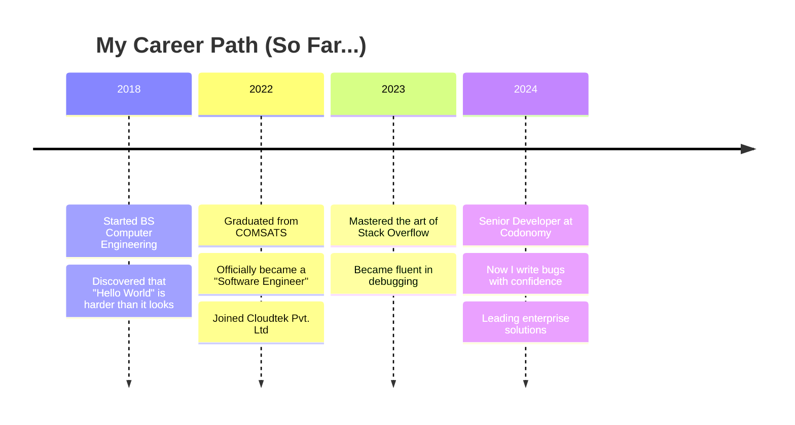

#

<!-- Clean Professional Header -->
<div align="center">
  
</div>

<!-- Professional Typing Animation -->
<div align="center">
  <a href="https://git.io/typing-svg">
    
  </a>
</div>

<!-- Social Links -->
<div align="center">
  <br>
  <a href="https://www.linkedin.com/in/muhammad-sohaib">
    
  </a>
  <a href="https://github.com/muhammadsohaib">
    
  </a>
  <a href="mailto:muhammadsohaib2000@gmail.com">
    
  </a>
  
  <br><br>
  
  
  
  
</div>

<br>

## 👋 About Me


```javascript
const muhammadSohaib = {
    role: "Senior Full-Stack Developer @ Codonomy",
    location: "Islamabad, Pakistan 📍",
    education: "BS Computer Engineering (COMSATS)",
    experience: "3+ years of making computers do magic ✨",
    
    currentlyWorking: [
        "Building enterprise solutions that actually work",
        "Turning coffee into clean code",
        "Debugging code I wrote at 3 AM"
    ],
    
    techStack: {
        backend: [".NET 6/8/9", "C#", "ASP.NET Core"],
        frontend: ["Angular", "TypeScript", "HTML/CSS"],
        database: ["SQL Server", "PostgreSQL", "Cosmos DB"],
        cloud: ["Azure", "Docker", "Kubernetes"],
        tools: ["Git", "VS Code", "Postman", "SonarQube"]
    },
    
    funFact: "I can center a div on the first try... sometimes 😅"
};
```

### 🎯 What I Actually Do

- 💻 Write code that my future self won't hate
- 🏗️ Build scalable solutions using Clean Architecture (because spaghetti belongs on plates, not in code)
- ☁️ Deploy stuff to Azure without breaking production (mostly)
- 🐛 Fix bugs and create new "features" simultaneously
- ☕ Convert caffeine into functional software

<br>

## 🛠️ Tech Stack

<div align="center">

### Languages & Frameworks


### Databases & Cloud


### Tools & Practices


</div>

<br>

## 🚀 Featured Projects

<table>
  <tr>
    <td width="50%">
      <h3 align="center">🏥 R1 RCM Healthcare Portal</h3>
      <div align="center">
        <p>
          <b>Tech:</b> .NET 8, CQRS, Azure Service Bus<br>
          <b>What it does:</b> Manages patient-physician interactions<br>
          <b>Cool factor:</b> Handles insurance workflows without crying
        </p>
      </div>
    </td>
    <td width="50%">
      <h3 align="center">📦 Vintage Point Logistics</h3>
      <div align="center">
        <p>
          <b>Tech:</b> .NET 6, Clean Architecture, SOAP/WSDL<br>
          <b>What it does:</b> Supply-chain for medical instruments<br>
          <b>Achievement:</b> Successfully integrated FedEx API on first try*<br>
          <sub>*after 47 attempts</sub>
        </p>
      </div>
    </td>
  </tr>
  <tr>
    <td width="50%">
      <h3 align="center">🛒 PNBN E-commerce</h3>
      <div align="center">
        <p>
          <b>Tech:</b> ASP.NET MVC, Multiple Payment Gateways<br>
          <b>What it does:</b> Sells stuff online<br>
          <b>Payment methods:</b> Everything except IOUs
        </p>
      </div>
    </td>
    <td width="50%">
      <h3 align="center">⚙️ Business Process Automation</h3>
      <div align="center">
        <p>
          <b>Tech:</b> Camunda, Azure DevOps, Docker<br>
          <b>What it does:</b> Automates boring stuff<br>
          <b>Time saved:</b> Enough to have a life
        </p>
      </div>
    </td>
  </tr>
</table>

<br>

## 💼 Professional Journey



### 📋 Work Experience

**🏢 Codonomy** | Senior Full-Stack Developer  
*March 2024 – Present*
- Building services with .NET 8/9 (and occasionally breaking them)
- Implementing Clean Architecture (because messy architecture is so 2023)
- Setting up CI/CD pipelines that actually work
- Containerizing everything with Docker 🐳

**🏢 Cloudtek Pvt. Ltd** | Software Engineer  
*August 2022 – February 2024*
- Built solutions with .NET and Azure
- Applied microservices patterns (divide and conquer!)
- Wrote unit tests (yes, I actually test my code)
- Survived countless Agile ceremonies

<br>

## 📊 GitHub Stats

<div align="center">
  
  
</div>

<br>

## 🎯 Current Goals

- [ ] Master Kubernetes without losing sanity
- [ ] Write code that doesn't need comments
- [ ] Find the perfect VS Code theme (currently at attempt #237)
- [ ] Build something that goes viral (besides bugs)
- [ ] Contribute more to open source

<br>

## 💭 Random Dev Wisdom

<div align="center">
  
*"It's not a bug, it's an undocumented feature."*

*"Works on my machine ¯\_(ツ)_/¯"*

*"There are only two hard things in Computer Science: cache invalidation, naming things, and off-by-one errors."*

</div>

<br>

## 📫 Let's Connect!

<div align="center">

I'm always excited to connect with fellow developers, collaborate on interesting projects, or just chat about tech!

📧 **Email:** muhammadsohaib2000@gmail.com  
📱 **Phone:** +92-3078170772  
📍 **Location:** Islamabad, Pakistan  

<br>

<a href="https://www.linkedin.com/in/muhammad-sohaib">
  
</a>

<br><br>

### ⚡ Fun Facts About Me

- 🎮 I debug code like I play video games - with lots of respawns
- 🍕 Pizza is my debugging fuel
- 🌙 My best code is written between 10 PM and 2 AM
- 🎵 Coding playlist: 50% lo-fi, 50% heavy metal
- 🤔 I still Google "how to center a div" occasionally

</div>

---

<div align="center">
  
  
  <b>Thanks for stopping by! May your code compile on the first try! 🚀</b>
  
  <br>
  
  ⭐ From [muhammadsohaib](https://github.com/muhammadsohaib) with bugs... I mean love 💙
</div>
